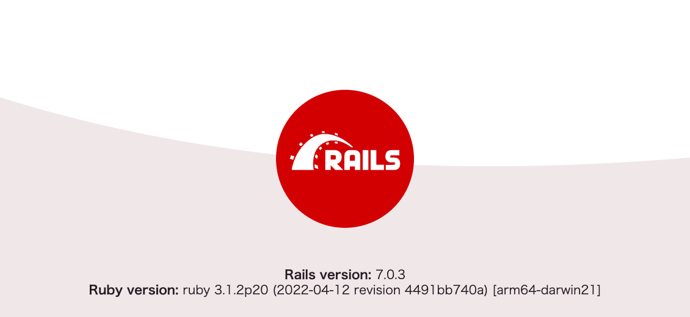

# 開発環境の準備

```sh
git clone [url]
cd summer2023-internship-server
./setup
```

講義では 3つのアプリケーションを開発します。

- bff
- minirecipe
- minihashtag

setup スクリプトでは以下を各アプリケーションに対して行っています。

- bundle install
依存 gem のインストール
- db:create
アプリケーションで使用するデータベースの作成
- ridgepole:apply
テーブル定義に従って、データベースのテーブルの更新
- db:seed:replant
テーブルの中身をリセット（テーブルの中身をすべて削除し、 seeds.rb に従ってシードデータを作成）

## 手元で実行

3つのアプリケーションを以下のポートで立ち上げます。

- bff
http://localhost:3000
- minirecipe
http://localhost:3001
- minihashtag
http://localhost:3002

順番に `bundle exec rails s` していってもいいのですが、ちょっと手間なので foreman を使ってまとめて立ち上げます。

```sh
foreman start
```

手元に foreman が入っていなければ install してください。

```sh
gem install foreman
```

http://localhost:3000, http://localhost:3001, http://localhost:3002 を開いて、下図のような画面が表示されたら OK です
(http://localhost:3000 は graphql-playground が表示されるようになっています)




### 個別で立ち上げる場合

```sh
cd bff
bundle exec rails s
```

### binding.irb などでブレークポイントを設置してデバッグしたい場合

foreman で実行しているとログが見辛くなってしまうので、デバッグしたいアプリケーションのみ別ターミナルで実行します。


```sh
foreman start -m minirecipe=1,minihashtag=1  # bff は foreman で実行しない

# 別ターミナルで
cd bff
bundle exec rails s
```

## 手元で動かすことができたら

[ハンズオンへ進みましょう](./02-hands-on.md)
