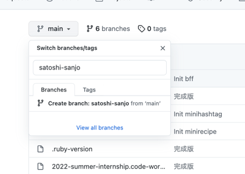
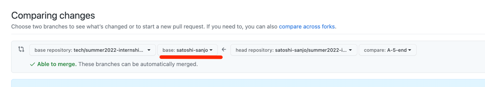

# ハンズオン

## 進め方

- 適宜キリのよいタイミングで commit しながら進めてください
- 困ったことはちょっと調べてわからなければ、気軽に講師や TA に質問してください
- 説明しながら進めますが、自分で進められそうだなと思ったら各自の判断で先に進んでもらって大丈夫です

## ハンズオンでやること

- A-1 [minirecipe] レシピ一覧の取得機能を追加
Rails の基本機能を一通りやってみる
- A-2 [minirecipe] レシピ一覧のレスポンスに user, ingredients, image_url を追加
  - Rails のリレーション
  - N+1 対策としての includes
  - リレーションを JSON レスポンスに含める方法
- A-3 [bff] レシピ一覧を取得するための Query を追加する
  - graphql-ruby の基本機能を一通りやってみる
- A-4 [minihashtag] ハッシュタグの作成機能を追加
  - Rails の Create をやってみる
- A-5 [bff] ハッシュタグを作成するための Mutation Field を追加
  - graphql-ruby で Mutation Field の追加をやってみる

# A-1 [minirecipe] レシピ一覧の取得機能を追加

`http://localhost:3001/recipes` にリクエストを投げたら、以下のようなレスポンスを返す機能を実装します。

```json
{
  "recipes": [
    {
      "id": 1,
      "title": "美味しい親子丼",
      "description": "とても美味しい親子丼です"
    },
    { ... },
    { ... }
  ]
}
```

MVC パターンの処理の流れと同じような順に実装していきます。

1. クライアントがリクエストする
1. URI に基づいて Router がどの Controller を呼び出すかを判断する
1. Controller がリクエストされた内容に基づいて、 Model や View を呼び出す
    - Model は紐づく DB からデータを取得したり、データの処理を行う
    - View は与えられた Model を利用して、クライアントに表示する内容を組み立てる
1. Controller が View が組み立てた結果をクライアントに返す

## やること

- `config/routes.rb` にどのリクエストをどのコントローラーで処理するかを定義する
- `controllers/recipes_controller.rb` の作成する
- `models/recipe.rb` でデータの操作をできるようにする
    - `recipes` テーブルの作成
    - recipe ダミーデータの作成
- `serializers/recipe_serializer.rb` で JSON を組み立てて、コントローラーからクライアントに返す


### `config/routes.rb` にどのリクエストをどのコントローラーで処理するかを定義する

どのエンドポイントへのリクエストがどのコントローラーに対応するのかは `routes.rb` に定義します。

今回は `/recipes` に対するリクエストを `recipes_controller` の `index` メソッドに対応させます。
これは rails が提供してくれているルーティングヘルパーで利用されている命名です。

rails ではデフォルトでリソースベースのルーティングを利用しており、 `resources` というヘルパーでルーティングをまとめて定義できます。
例えば、 `routes.rb` に `resources :recipes` と書くと以下のようなルーティングが作成されます。

| URI | HTTP Method | Action | Controller#Method |
|:-:|:-:|:-:|:-:|
| `/recipes` | GET | レシピの一覧を返す | recipes#index |
| `/recipes/new` | GET | 新規作成のためのフォームを返す | recipes#new |
| `/recipes` | POST | レシピを作成する | recipes#create |
| `/recipes/:id` | GET | 特定のレシピを返す | recipes#show |
| `/recipes/:id/edit` | GET | 特定のレシピの編集用のフォームを返す | recipes#edit |
| `/recipes/:id` | PUT | 特定のレシピを更新する | recipes#update |
| `/recipes/:id` | DELETE | 特定のレシピを削除する | recipes#destroy |

今回は、レシピの一覧を取得するためのエンドポイントなので `recipes#index` へのルーティングを定義します。
`recipes#index` と書くと、 `RecipesController` の `index` というメソッドが呼び出されます。

```diff
diff --git a/minirecipe/config/routes.rb b/minirecipe/config/routes.rb
index 3254a10..b91e223 100644
--- a/minirecipe/config/routes.rb
+++ b/minirecipe/config/routes.rb
@@ -1,5 +1,6 @@
 Rails.application.routes.draw do
   # Define your application routes per the DSL in https://guides.rubyonrails.org/routing.html
+  get 'recipes', to: "recipes#index"
+  # or resources :recipes, only: [:index]

   get '/hello/revision' => RevisionPlate::App.new
 end
 ```

ルーティングの書き方に困ったときや、もっと知りたい場合はこちらを見てみてください
https://railsguides.jp/routing.html

### `controllers/recipes_controller.rb` の作成する

ルーティングを定義して、`/recipes` へのリクエストが `RecipesController` で処理されるようになったので、そのためのコントローラーを作っていきます。
まずは動作の確認も含めて `{"Hello": "Rails"}` を返すようにします。`recipes_controller.rb` というファイルを作成し、以下のように実装してください。

```sh
touch app/controllers/recipes_controller.rb
```

```diff
diff --git a/minirecipe/app/controllers/recipes_controller.rb b/minirecipe/app/controllers/recipes_controller.rb
new file mode 100644
index 0000000..d3d5c58
--- /dev/null
+++ b/minirecipe/app/controllers/recipes_controller.rb
@@ -0,0 +1,5 @@
+class RecipesController < ApplicationController
+  def index
+    render json: { "Hello": "Rails" }
+  end
+end
```

実際にリクエストを投げて動作を確認してみましょう。

```sh
$ curl -s http://localhost:3001/recipes | jq .
{
  "Hello": "Rails"
}
```

コントローラーを作成したので、次はコントローラーの中で実際にどういうモデルを呼び出して、どういうレスポンスを返すのかを書いていきましょう！

### `models/recipe.rb` でデータの操作をできるようにする

まずはモデルを作成します。
モデルは DB からデータを取得したり、データの処理を行う役割です。

今回は、素朴に DB からデータを取得して返すだけで十分そうです。
今回はレシピというリソースを扱うためのモデルを作成するので、 `Recipe` というモデルにします。
rails の規約に従って、 `recipe.rb` というファイルを作り、 `Recipe` モデルを作成します。


```sh
bundle exec rails g model recipe --no-migration --skip-test-framework
```

```diff
diff --git a/minirecipe/app/models/recipe.rb b/minirecipe/app/models/recipe.rb
new file mode 100644
index 0000000..69523fd
--- /dev/null
+++ b/minirecipe/app/models/recipe.rb
@@ -0,0 +1,2 @@
+class Recipe < ApplicationRecord
+end
```

今回は DB からデータを取得するための実装をする必要があります。
しかし、 rails ではモデル層に ActiveRecord という O/R マッパーを利用しており、 ActiveRecord が DB に対する SQL の発行を肩代わりしてくれるので、規約に従っている限りはデータ取得に関する特別なロジックを書く必要はありません。


`Recipe` モデルは `ApplicationRecord` を継承していて、さらに `ApplicationRecord` は `ActiveRecord::Base` を継承しています。

```ruby:app/models/application_record.rb
class ApplicationRecord < ActiveRecord::Base
  primary_abstract_class
end
```

ActiveRecord をもっと知りたくなった方はこちらを見てみてください
https://railsguides.jp/active_record_basics.html


ActiveRecord を利用することでデータの操作を肩代わりしてもらいました。
実際にどのように使うのかをかんたんに見てみたいのですが、まだ肝心の操作する対象のテーブルがありません。
なので、まずはテーブルを作成してから、どのように操作するのかを見てみましょう。

#### `recipes` テーブルの作成

テーブル名は ActiveRecord の規約で決まっており、モデル名を複数形にして、 snake_case にしたものにします。
なのでレシピのデータを扱うための `Recipe` モデルに対応するテーブルは `recipes` テーブルになります。

テーブルのスキーマは以下のようにします。
主キーは ActiveRecord の規約に従い `id` という名前にします。
`created_at`, `updated_at` は ActiveRecord が予約しているカラムです。作成日時と更新日時を自動で記録してくれます。

| column | type | option |
|:-:|:-:|:-:|
|id|bigint| primary key|
|title|string| null: false |
|description|string| null: false|
|created_at|datetime| null: false|
|updated_at|datetime| null: false|

クックパッドではテーブルの管理には [`ridgepole` という gem](https://github.com/ridgepole/ridgepole) を利用するのが一般的です。
これはテーブルの定義を宣言的に記述していれば、実際の DB の状態との差分を検知し、記述している状態になるようにしてくれるものです。
Schemafile に `recieps` テーブルのスキーマを記述します。

```diff
diff --git a/minirecipe/db/Schemafile b/minirecipe/db/Schemafile
index e69de29..4dcf6ba 100644
--- a/minirecipe/db/Schemafile
+++ b/minirecipe/db/Schemafile
@@ -0,0 +1,8 @@
+create_table :recipes do |t|  # id はデフォルトで主キーとして作成される
+  t.string :title, null: false
+  t.string :description, null: false
+
+  t.timestamps  # created_at, updated_at に展開される
+end
```

定義したスキーマを DB に反映させます。

```sh
$ cd minirecipe
$ bundle exec rake ridgepole:dry-run
ridgepole --config config/database.yml --env development --apply --dry-run --file db/Schemafile --drop-table
Apply `db/Schemafile` (dry-run)
create_table("recipes", **{}) do |t|
  t.column("title", :"string", **{:null=>false, :limit=>255})
  t.column("description", :"string", **{:null=>false, :limit=>255})
  t.column("created_at", :"datetime", **{:null=>false})
  t.column("updated_at", :"datetime", **{:null=>false})
end

# CREATE TABLE `recipes` (
# `id` bigint NOT NULL AUTO_INCREMENT PRIMARY KEY,
# `title` varchar(255) NOT NULL,
# `description` varchar(255) NOT NULL,
# `created_at` datetime(6) NOT NULL,
# `updated_at` datetime(6) NOT NULL)

$ bundle exec rake ridgepole:apply
ridgepole --config config/database.yml --env development --apply --file db/Schemafile --drop-table
Apply `db/Schemafile`
-- create_table("recipes")
   -> 0.0269s
ridgepole --config config/database.yml --env test --apply --file db/Schemafile --drop-table
Apply `db/Schemafile`
-- create_table("recipes")
   -> 0.0246s
```

テーブルが作成できました。

### recipe ダミーデータの作成

テーブルとモデルを作成したので、使い方を見てみながら、ダミーデータを作成してみましょう。
rails が `rails console` というツールを提供してくれており、デバッグ作業に便利です。
rails のアプリケーションサーバーと同じコードを読み込んで対話的にコードを実行することができます。

```sh
$ bundle exec rails console
Loading development environment (Rails 7.0.3)
irb(main):001:0> Recipe.table_name
=> "recipes"
irb(main):002:0> recipe = Recipe.new(title: "美味しい親子丼", description: "とても美味しい親子丼です")
=> #<Recipe:0x00000001085c8470 id: nil, title: "美味しい親子丼", description: "とても美味しい親子丼です", created_at...
irb(main):003:0> recipe.save
  TRANSACTION (0.4ms)  BEGIN
  Recipe Create (0.9ms)  INSERT INTO `recipes` (`title`, `description`, `created_at`, `updated_at`) VALUES ('美味しい親子丼', 'とても美味しい親子丼です', '2023-07-19 10:00:00.509254', '2023-07-19 10:00:00.509254')
  TRANSACTION (0.7ms)  COMMIT
=> true
irb(main):004:0> recipe
=>
#<Recipe:0x00000001085c8470
 id: 1,
 title: "美味しい親子丼",
 description: "とても美味しい親子丼です",
 created_at: Tue, 19 Jul 2023 10:00:00.509254000 UTC +00:00,
 updated_at: Tue, 19 Jul 2023 10:00:00.509254000 UTC +00:00>
irb(main):004:0> Recipe.all
  Recipe Load (0.6ms)  SELECT `recipes`.* FROM `recipes`
=>
[#<Recipe:0x0000000109a5c4b8
  id: 1,
  title: "美味しい親子丼",
  description: "とても美味しい親子丼です",
  created_at: Tue, 19 Jul 2023 10:00:00.509254000 UTC +00:00,
  updated_at: Tue, 19 Jul 2023 10:00:00.509254000 UTC +00:00>]
```

レシピデータを一つ作成しました。

ActiveRecord の操作については [Rails ガイドの「CRUD: データの読み書き」の章](https://railsguides.jp/active_record_basics.html#crud-%E3%83%87%E3%83%BC%E3%82%BF%E3%81%AE%E8%AA%AD%E3%81%BF%E6%9B%B8%E3%81%8D) にあるので適宜参考にしてください。

### `serializers/recipe_serializer.rb` で JSON を組み立てて、コントローラーからクライアントに返す

コントローラーの作成をして、モデルの定義をしました。
次はレスポンスを組み立てる部分を実装しましょう。

その前に、今のコントローラーはただの文字列を返しているだけの仮実装なので、実際のデータを返すようにしましょう。
一旦素朴に `recipes` テーブルにあるデータの最初の 10 件を json 形式で返すようにします。


```diff
diff --git a/minirecipe/app/controllers/recipes_controller.rb b/minirecipe/app/controllers/recipes_controller.rb
index d3d5c58..4c2fb0e 100644
--- a/minirecipe/app/controllers/recipes_controller.rb
+++ b/minirecipe/app/controllers/recipes_controller.rb
@@ -1,5 +1,6 @@
 class RecipesController < ApplicationController
   def index
-    render json: { "Hello": "Rails" }
+    @recipes = Recipe.first(10)
+    render json: @recipes
   end
 end
```

実際にレスポンスがどうなっているか確認します。

```sh
$ curl -s http://localhost:3001/recipes | jq .
[
  {
    "id": 1,
    "title": "美味しい親子丼",
    "description": "とても美味しい親子丼です",
    "created_at": "2023-07-19T10:00:00.509Z",
    "updated_at": "2023-07-19T10:00:00.509Z"
  }
]
```

無事 `recipes` テーブルの内容が JSON として返されるようになりました。一方でこの節の最初で示した形とは異なる JSON になってしまっています（タイムスタンプは要らない、ルートに `recipes` フィールドが無い）。そこでこのレスポンスを整形していきます。

レスポンスを整形する方法としていくつか選択肢があるのですが、この講義では [ActiveModelSerializers](https://github.com/rails-api/active_model_serializers/tree/0-10-stable) という gem を利用します。

これは serializer クラスを定義して、そこにレスポンスとして返すフィールドを定義すれば、それに従ってレスポンスを組み立ててくれるものです。
rails と同じように規約があり、Model と同じ命名にしておくと、勝手に適用されます。
`Recipe` モデルに対して serializer を適用したいので、 `RecipeSerializer` という名前で作成します。

```sh
touch app/serializers/recipe_serializer.rb
```

```diff
diff --git a/minirecipe/app/serializers/recipe_serializer.rb b/minirecipe/app/serializers/recipe_serializer.rb
new file mode 100644
index 0000000..eaff33d
--- /dev/null
+++ b/minirecipe/app/serializers/recipe_serializer.rb
@@ -0,0 +1,3 @@
+class RecipeSerializer < ActiveModel::Serializer
+  attributes :id, :title, :description
+end
```

ではレスポンスを再度確認します。

 ```sh
 curl -s http://localhost:3001/recipes | jq .
{
  "recipes": [
    {
      "id": 1,
      "title": "美味しい親子丼",
      "description": "とても美味しい親子丼です"
    }
  ]
}
```

目的のレスポンスが得られました！

※読み飛ばして良い補足：ここで、実はこのレスポンスは ActiveModelSerializers のデフォルトとは異なる出力になっています。簡単のため、今回は `config/initializers/active_model_serializers.rb` であらかじめデフォルト設定を変えておきました。
詳しくはドキュメントをご覧ください: https://github.com/rails-api/active_model_serializers/blob/0-10-stable/docs/general/adapters.md

これで `GET /recipes` を作ることができました。一旦立ち止まって、ここで `git commit` しておきましょう。
以降もキリのよいところで commit をしておくと差分を追いやすいです。

# A-2 [minirecipe] レシピ一覧のレスポンスに user, ingredients, image_url を追加

`http://localhost:3001/recipes` にリクエストを投げたら、以下のようなレスポンスを返す機能を実装します。

```json
{
  "recipes": [
    {
      "id": 1,
      "title": "美味しい親子丼",
      "description": "とても美味しい親子丼です",
      "ingredients": [
        {
          "id": 1,
          "name": "鶏肉"
        },
        {
          "id": 2,
          "name": "玉ねぎ"
        },
        { ... }
      ],
      "user": {
        "id": 1,
        "name": "クックパッドたん"
      },
      "image_url": "https://xxx.com/xxx.jpg"
    }
  ]
}
```

## 仕様

- `ingredients` は position というカラムを作り、 position の昇順でリストを返すこと

## やること

- `ingredients` フィールドを作る
  - `ingredients` テーブルを作る
  - `Ingredient` モデルを作成して `Recipe` と関連を持たせる
  - JSON レスポンスに含めるようにする
- シードデータの準備
- `user` フィールドを作る
- `image_url` フィールドを作る
  - `Recipe` モデルに `image_url` を組み立てるためのロジックを書く
- パフォーマンス・チューニング
  - N+1 クエリの対策をする

### `ingredients` フィールドを作る

テーブル作成、モデル作成までは A-1 と同じことをします。

`ingredients` テーブルは以下のようにします

| column | type | option |
|:-:|:-:|:-:|
|id|bigint| primary key|
|recipe_id|bigint| null: false |
|name|string| null: false |
|position|integer| null: false|
|created_at|datetime| null: false|
|updated_at|datetime| null: false|

`recipe_id` を使ってどのレシピの材料なのかを判断します。

```diff
diff --git a/minirecipe/app/models/ingredient.rb b/minirecipe/app/models/ingredient.rb
new file mode 100644
index 0000000..a1faeb5
--- /dev/null
+++ b/minirecipe/app/models/ingredient.rb
@@ -0,0 +1,2 @@
+class Ingredient < ApplicationRecord
+end
diff --git a/minirecipe/db/Schemafile b/minirecipe/db/Schemafile
index 260edd1..74f002d 100644
--- a/minirecipe/db/Schemafile
+++ b/minirecipe/db/Schemafile
@@ -4,3 +4,10 @@ create_table :recipes do |t|

   t.timestamps
 end
+
+create_table :ingredients do |t|
+  t.bigint :recipe_id, null: false
+  t.string :name, null: false
+  t.integer :position, null: false
+
+  t.timestamps
+end
```

`ridgepole:apply` も忘れずに行いましょう

次に、 rails 上でモデル間の関連を定義します。
関連付けには rails で用意してくれているヘルパーを利用します。

- belongs_to
他方のモデルに 1 対 1 で従属していることを示します。
- has_one
他方のモデルに 1 対 1 で紐付いており、相手側が参照を保持していることを示します。
- has_many
他方のモデルに 1 対 多で紐付いており、相手側が参照を保持していることを示します。

詳細はこちらを参考にしてください
https://railsguides.jp/association_basics.html#%E9%96%A2%E9%80%A3%E4%BB%98%E3%81%91%E3%81%AE%E7%A8%AE%E9%A1%9E

今回は `Recipe` モデルに対して、 `Ingredient` モデルが複数個紐付いているので、`Recipe` 起点で表現すると `Recipe has_many Ingredients` という表現になるので、そのままそれをモデルに定義します。

```diff
diff --git a/minirecipe/app/models/recipe.rb b/minirecipe/app/models/recipe.rb
index 69523fd..d854fbe 100644
--- a/minirecipe/app/models/recipe.rb
+++ b/minirecipe/app/models/recipe.rb
@@ -1,2 +1,3 @@
 class Recipe < ApplicationRecord
+  has_many :ingredients, -> { order(:position) }
 end
```

このタイミングで、 `position` の昇順で返したいので、オプションで指定して関連を取ってくるタイミングで並び替えておきます。
参考： [has_manyのスコープについて](https://railsguides.jp/association_basics.html#has-many%E3%81%AE%E3%82%B9%E3%82%B3%E3%83%BC%E3%83%97%E3%81%AB%E3%81%A4%E3%81%84%E3%81%A6
)

動作確認も含めて `rails console` でダミーデータの作成を行います。

```ruby
irb(main):002:0> recipe = Recipe.first
  Recipe Load (0.4ms)  SELECT `recipes`.* FROM `recipes` ORDER BY `recipes`.`id` ASC LIMIT 1
=>
#<Recipe:0x0000000115787740
...
irb(main):001:0> recipe.ingredients.create(name: "鶏肉", position: 1) # 関連を定義しているのでこういう書き方もできる
  TRANSACTION (0.1ms)  BEGIN
  Ingredient Create (0.3ms)  INSERT INTO `ingredients` (`recipe_id`, `name`, `position`, `created_at`, `updated_at`) VALUES (1, '鶏肉', 1, '2023-07-19 10:38:49.104538', '2023-07-19 10:38:49.104538')
  TRANSACTION (0.6ms)  COMMIT
=>
#<Ingredient:0x000000011404dde0
 id: 1,
 recipe_id: 1,
 name: "鶏肉",
 position: 1,
 created_at: Tue, 19 Jul 2023 10:38:49.104538000 UTC +00:00,
 updated_at: Tue, 19 Jul 2023 10:38:49.104538000 UTC +00:00>
irb(main):002:0> recipe.ingredients
  Ingredient Load (0.3ms)  SELECT `ingredients`.* FROM `ingredients` WHERE `ingredients`.`recipe_id` = 1
=>
[#<Ingredient:0x000000010b3b50e0
  id: 1,
  recipe_id: 1,
  name: "鶏肉",
  position: 1,
  created_at: Tue, 19 Jul 2023 10:38:49.104538000 UTC +00:00,
  updated_at: Tue, 19 Jul 2023 10:38:49.104538000 UTC +00:00>]
irb(main):003:0> recipe.ingredients.create([{name: "卵", position: 3}, {name: "玉ねぎ", position: 2}])
```

これでモデル間の関連を定義できたので、次に JSON レスポンスに `ingredients` を含むようにしてみましょう。
レシピのときと同じように `IngredientSerializer` を定義し、 ActiveRecord の関連付けと同じように `has_many` を書くと serializer の関連付けは完了です。

```diff
diff --git a/minirecipe/app/serializers/ingredient_serializer.rb b/minirecipe/app/serializers/ingredient_serializer.rb
new file mode 100644
index 0000000..d6ba134
--- /dev/null
+++ b/minirecipe/app/serializers/ingredient_serializer.rb
@@ -0,0 +1,3 @@
+class IngredientSerializer < ActiveModel::Serializer
+  attributes :id, :name
+end
diff --git a/minirecipe/app/serializers/recipe_serializer.rb b/minirecipe/app/serializers/recipe_serializer.rb
index eaff33d..cab4f05 100644
--- a/minirecipe/app/serializers/recipe_serializer.rb
+++ b/minirecipe/app/serializers/recipe_serializer.rb
@@ -1,3 +1,5 @@
 class RecipeSerializer < ActiveModel::Serializer
+  has_many :ingredients
+
   attributes :id, :title, :description
 end
```

レスポンスを確認してみましょう。正しく取得できていれば OK です！
（確認のための position も返すようにしています）

```json
{
  "recipes": [
    {
      "id": 1,
      "title": "美味しい親子丼",
      "description": "とても美味しい親子丼です",
      "ingredients": [
        {
          "id": 1,
          "name": "鶏肉",
          "position": 1
        },
        {
          "id": 3,
          "name": "玉ねぎ",
          "position": 2
        },
        {
          "id": 2,
          "name": "卵",
          "position": 3
        }
      ]
    }
  ]
}
```

### シードデータの準備

ここまで動作確認のために度々 `rails console` でダミーデータを作成していましたが、毎度やるのは手間がかかって不便です。

そこで、今回の講義用に、ダミーデータをまとめて作成できるスクリプトを用意してあるので、そちらを使ってください。

以下のコマンドを実行すると一度テーブルの中身をすべて削除した後に、ダミーデータをまとめて挿入してくれます。（データがリセットされる）

```sh
bundle exec rails db:seed:replant
```

今後講義で追加していく予定のカラムにも対応しているので、カラム追加などを行った場合は、データのリセットをおすすめします。

```sh
bundle exec rake ridgepole:apply && bundle exec rails db:seed:replant
```

試しにレシピ一覧を取得してみると、たくさんのレスポンスが返ってきていると思います。

```sh
curl -s http://localhost:3001/recipes | jq .
```

### `user` フィールドを作る

基本的には、`ingredients` のときと同じです。
今回の相違点としては、`Recipe belongs to user`（材料とは逆）であることです。
これは従来どおり、テーブル、モデルを作成し、レシピに紐付けるタイミングで `has_many` ではなくて `belongs_to` で関連を定義することで実現できます。

おさらいを兼ねてやってみましょう。
テーブルを追加、変更したときはデータのリセットを忘れないようにしましょう。

完成形の差分は以下のようになります。

```diff
diff --git a/minirecipe/app/models/user.rb b/minirecipe/app/models/user.rb
new file mode 100644
index 0000000..e399202
--- /dev/null
+++ b/minirecipe/app/models/user.rb
@@ -0,0 +1,2 @@
+class User < ApplicationRecord
+end
diff --git a/minirecipe/app/models/recipe.rb b/minirecipe/app/models/recipe.rb
index 7e7b027..43b7f16 100644
--- a/minirecipe/app/models/recipe.rb
+++ b/minirecipe/app/models/recipe.rb
@@ -1,3 +1,4 @@
 class Recipe < ApplicationRecord
   has_many :ingredients, -> { order(:position) }
+  belongs_to :user
 end
diff --git a/minirecipe/app/serializers/user_serializer.rb b/minirecipe/app/serializers/user_serializer.rb
new file mode 100644
index 0000000..6fd2178
--- /dev/null
+++ b/minirecipe/app/serializers/user_serializer.rb
@@ -0,0 +1,3 @@
+class UserSerializer < ActiveModel::Serializer
+  attributes :id, :name
+end
diff --git a/minirecipe/app/serializers/recipe_serializer.rb b/minirecipe/app/serializers/recipe_serializer.rb
index cab4f05..32d683e 100644
--- a/minirecipe/app/serializers/recipe_serializer.rb
+++ b/minirecipe/app/serializers/recipe_serializer.rb
@@ -1,5 +1,6 @@
 class RecipeSerializer < ActiveModel::Serializer
   has_many :ingredients
+  belongs_to :user

   attributes :id, :title, :description
 end
diff --git a/minirecipe/db/Schemafile b/minirecipe/db/Schemafile
index 37b7dd9..a87c0d5 100644
--- a/minirecipe/db/Schemafile
+++ b/minirecipe/db/Schemafile
@@ -1,4 +1,5 @@
 create_table :recipes do |t|
+  t.bigint :user_id, null: false
   t.string :title, null: false
   t.string :description, null: false

@@ -12,3 +13,9 @@ create_table :ingredients do |t|

   t.timestamps
 end
+
+create_table :users do |t|
+  t.string :name, null: false
+
+  t.timestamps
+end
```

### `image_url` フィールドを作る

次にレシピのメイン画像を表示するために利用する URL を指定するフィールドを追加します。
クックパッドでは tofu と呼ばれる独自の画像配信サービスを利用して画像を表示するようにしています。
tofu の特徴としては、画像のサイズを URL に含めて動的に指定することができる点です。

講義では tofu の仕組みについては時間の都合上ブラックボックスのまま進めていきます。

この講義では tofu をブラックボックス的に利用するための `app/models/concerns/tofuable.rb` というモジュールを用意しているので、こちらを利用してください。

使い方はモデルに `include Tofuable` という形で読み込むだけで、読み込むと `Tofuable` に定義してあるメソッド等が利用できるようになります。
これは rails の [ActiveSupport::Concern](https://api.rubyonrails.org/v7.0.3/classes/ActiveSupport/Concern.html) という関心事を分離しつつ使いまわしができる仕組みを利用しています。

`Tofuable` をインクルードしているモデルでは `image_url` というメソッドが利用できるようになります。
`image_url` はモデルの `photo_saved_at` というカラムに値が存在するときに画像の URL を返し、値が存在しないときは `nil` を返します。
また、 `image_url` に引数として画像サイズ (例： `200x200` や `200x200c`) を指定することができて、指定するとそのサイズにリサイズ・クロッピングした画像の URL を生成してくれます。

以下は利用例です。

```ruby
irb(main):001:0> recipe = Recipe.find_by("photo_saved_at is not null")
  Recipe Load (0.4ms)  SELECT `recipes`.* FROM `recipes` WHERE (photo_saved_at is not null) LIMIT 1
=>
#<Recipe:0x000000010ce35460
...
irb(main):002:0> recipe.image_url
=> "https://placehold.jp/m.png"
irb(main):003:0> recipe.image_url("200x200")
=> "https://placehold.jp/m.png"
irb(main):004:0> recipe.image_url("200x200c")
=> "https://placehold.jp/m.png"
```

なので、 `image_url` フィールドを追加するための流れとしては、以下のようになります。

- `recipes` テーブルに `datetime` 型の `photo_saved_at` カラムを `null: true` で追加
- （データのリセット： `photo_saved_at` の値が入ります）
- `Recipe` モデルで `Tofuable` をインクルード
- JSON のレスポンスに `image_url` を含める

実装すると以下のようになります。

```diff
diff --git a/minirecipe/app/models/recipe.rb b/minirecipe/app/models/recipe.rb
index 43b7f16..69d26af 100644
--- a/minirecipe/app/models/recipe.rb
+++ b/minirecipe/app/models/recipe.rb
@@ -1,4 +1,6 @@
 class Recipe < ApplicationRecord
+  include Tofuable
+
   has_many :ingredients, -> { order(:position) }
   belongs_to :user
 end
diff --git a/minirecipe/app/serializers/recipe_serializer.rb b/minirecipe/app/serializers/recipe_serializer.rb
index 32d683e..c9b713b 100644
--- a/minirecipe/app/serializers/recipe_serializer.rb
+++ b/minirecipe/app/serializers/recipe_serializer.rb
@@ -2,5 +2,5 @@ class RecipeSerializer < ActiveModel::Serializer
   has_many :ingredients
   belongs_to :user

-  attributes :id, :title, :description
+  attributes :id, :title, :description, :image_url
 end
diff --git a/minirecipe/db/Schemafile b/minirecipe/db/Schemafile
index a87c0d5..6a68d2d 100644
--- a/minirecipe/db/Schemafile
+++ b/minirecipe/db/Schemafile
@@ -2,6 +2,7 @@ create_table :recipes do |t|
   t.bigint :user_id, null: false
   t.string :title, null: false
   t.string :description, null: false
+  t.datetime :photo_saved_at, null: true

   t.timestamps
 end
```

さて、このままでも画像の URL を返すことができているのですが、せっかく tofu が動的にサイズを変更できるにも関わらず、デフォルト値の画像サイズしか使えていません。
せっかくなので、リクエスト時のパラメーターを参照して動的に画像サイズを変更できるようにしてみましょう。

```
http://localhost:3000/recipes?image_size=200x200c
```

リクエストパラメーターには controller から `params` という変数を使って参照できます。
今回は `image_size` というパラメーターが送られてきているので、 `params[:image_size]` という形で参照することができます。

`params` についての詳細はこちらを参照してください。
https://railsguides.jp/action_controller_overview.html#%E3%83%91%E3%83%A9%E3%83%A1%E3%83%BC%E3%82%BF

また、 serializer に引数を渡したい場合は、 `render` のタイミングでオプションとして引数を指定すると serializer の中で `instance_options` という変数から参照できます。
参考： [ActiveModelSerializers gem のドキュメント](https://github.com/rails-api/active_model_serializers/blob/v0.10.13/docs/howto/passing_arbitrary_options.md)

```diff
diff --git a/minirecipe/app/controllers/recipes_controller.rb b/minirecipe/app/controllers/recipes_controller.rb
index a00aac5..ceb6775 100644
--- a/minirecipe/app/controllers/recipes_controller.rb
+++ b/minirecipe/app/controllers/recipes_controller.rb
@@ -1,6 +1,6 @@
 class RecipesController < ApplicationController
   def index
     @recipes = Recipe.first(10)
-    render json: @recipes
+    render json: @recipes, image_size: params[:image_size]
   end
 end
diff --git a/minirecipe/app/serializers/recipe_serializer.rb b/minirecipe/app/serializers/recipe_serializer.rb
index c9b713b..fa6deb9 100644
--- a/minirecipe/app/serializers/recipe_serializer.rb
+++ b/minirecipe/app/serializers/recipe_serializer.rb
@@ -3,4 +3,8 @@ class RecipeSerializer < ActiveModel::Serializer
   belongs_to :user

   attributes :id, :title, :description, :image_url
+
+  def image_url
+    object.image_url(instance_options[:image_size])
+  end
 end
 ```

 これでリクエストの際にパラメーターで画像サイズを動的に指定できるようになりました。

 #### パフォーマンス・チューニング

 #### N+1 問題

ここで `/recipes` にリクエストを投げて見てください。
rails server を起動しているコンソールのログを見てみると、大量の SQL が実行されている様子が見られると思います。

```log
03:15:20 minirecipe.1  |   Recipe Load (0.5ms)  SELECT `recipes`.* FROM `recipes`
03:15:20 minirecipe.1  |   ↳ app/controllers/recipes_controller.rb:4:in `index'
03:15:20 minirecipe.1  | [active_model_serializers]   Ingredient Load (0.6ms)  SELECT `ingredients`.* FROM `ingredients` WHERE `ingredients`.`recipe_id` = 247168 ORDER BY `ingredients`.`position` ASC
03:15:20 minirecipe.1  | [active_model_serializers]   ↳ app/controllers/recipes_controller.rb:4:in `index'
03:15:20 minirecipe.1  | [active_model_serializers]   User Load (0.2ms)  SELECT `users`.* FROM `users` WHERE `users`.`id` = 54489 LIMIT 1
03:15:20 minirecipe.1  | [active_model_serializers]   ↳ app/controllers/recipes_controller.rb:4:in `index'
03:15:20 minirecipe.1  | [active_model_serializers]   Ingredient Load (0.5ms)  SELECT `ingredients`.* FROM `ingredients` WHERE `ingredients`.`recipe_id` = 315124 ORDER BY `ingredients`.`position` ASC
03:15:20 minirecipe.1  | [active_model_serializers]   ↳ app/controllers/recipes_controller.rb:4:in `index'
03:15:20 minirecipe.1  | [active_model_serializers]   CACHE User Load (0.0ms)  SELECT `users`.* FROM `users` WHERE `users`.`id` = 54489 LIMIT 1
03:15:20 minirecipe.1  | [active_model_serializers]   ↳ app/controllers/recipes_controller.rb:4:in `index'
03:15:20 minirecipe.1  | [active_model_serializers]   Ingredient Load (0.9ms)  SELECT `ingredients`.* FROM `ingredients` WHERE `ingredients`.`recipe_id` = 547054 ORDER BY `ingredients`.`position` ASC
03:15:20 minirecipe.1  | [active_model_serializers]   ↳ app/controllers/recipes_controller.rb:4:in `index'
03:15:20 minirecipe.1  | [active_model_serializers]   User Load (0.6ms)  SELECT `users`.* FROM `users` WHERE `users`.`id` = 315788 LIMIT 1
03:15:20 minirecipe.1  | [active_model_serializers]   ↳ app/controllers/recipes_controller.rb:4:in `index'
03:15:20 minirecipe.1  | [active_model_serializers]   Ingredient Load (0.5ms)  SELECT `ingredients`.* FROM `ingredients` WHERE `ingredients`.`recipe_id` = 841326 ORDER BY `ingredients`.`position` ASC
03:15:20 minirecipe.1  | [active_model_serializers]   ↳ app/controllers/recipes_controller.rb:4:in `index'
03:15:20 minirecipe.1  | [active_model_serializers]   User Load (0.2ms)  SELECT `users`.* FROM `users` WHERE `users`.`id` = 1123573 LIMIT 1
03:15:20 minirecipe.1  | [active_model_serializers]   ↳ app/controllers/recipes_controller.rb:4:in `index'
```

もう少しよく見ると、だいたい同じようなクエリになっていて、以下のクエリがたくさんあることがわかります。
ここの `recipe_id = xxx` の変数だけ変わって後は同じクエリが流れています。

```
Ingredient Load (0.6ms)  SELECT `ingredients`.* FROM `ingredients` WHERE `ingredients`.`recipe_id` = xxx ORDER BY `ingredients`.`position` ASC
```

`User` に関しても同様に同じクエリがたくさん流れています。

これらのデータを取得したい場合は `recipe_id in (xxx, yyy, zzz)` のようにすれば一度のクエリでほしいデータを取得することができるはずです。
何度もクエリを投げていると、DB に負荷がかかるし、非効率です。これは N+1 問題と言われるものです。
参考： https://railsguides.jp/active_record_querying.html#%E9%96%A2%E9%80%A3%E4%BB%98%E3%81%91%E3%82%92eager-loading%E3%81%99%E3%82%8B

N+1 問題に対応するために rails がヘルパーを用意してくれているので、それを使って N+1 問題を解消しましょう。

```diff
diff --git a/minirecipe/app/controllers/recipes_controller.rb b/minirecipe/app/controllers/recipes_controller.rb
index ceb6775..65534e4 100644
--- a/minirecipe/app/controllers/recipes_controller.rb
+++ b/minirecipe/app/controllers/recipes_controller.rb
@@ -1,6 +1,6 @@
 class RecipesController < ApplicationController
   def index
-    @recipes = Recipe.first(10)
+    @recipes = Recipe.includes(:user, :ingredients).first(10)
     render json: @recipes, image_size: "200x200c"
   end
 end
```

クエリがまとまって、3回のクエリで済んでいることがわかると思います。
これはとても便利なヘルパーなのですが、つい気を抜いていると忘れてしまって、 N+1 が発生してしまうので気をつけましょう。

#### MySQL のインデックス

さて、 N+1 問題を解消したので一安心なのですが、パフォーマンスを考える際にはもう一点、データベースのインデックスについても気にしないといけません。

インデックスがない状態で SQL を実行すると、テーブル内の全行をチェックしないとならず、とても非効率です。

```
SELECT `ingredients`.* FROM `ingredients` WHERE `ingredients`.`recipe_id` IN (247168, 315124, 547054, 841326, 913209, 938853, 1152641, 1229479, 1261678, 1269502) ORDER BY `ingredients`.`position` ASC
```

補足： `rails db` というコマンドを使うと、 rails サーバーが接続している DB にログインできます

```sql
mysql> select count(1) from ingredients;
+----------+
| count(1) |
+----------+
|      732 |
+----------+
```

インデックスなしの状態で explain した結果
全行を読み込んでいることがわかります。


```sql
+----+-------------+-------------+------------+------+---------------+------+---------+------+------+----------+-----------------------------+
| id | select_type | table       | partitions | type | possible_keys | key  | key_len | ref  | rows | filtered | Extra                       |
+----+-------------+-------------+------------+------+---------------+------+---------+------+------+----------+-----------------------------+
|  1 | SIMPLE      | ingredients | NULL       | ALL  | NULL          | NULL | NULL    | NULL |  732 |    10.00 | Using where; Using filesort |
+----+-------------+-------------+------------+------+---------------+------+---------+------+------+----------+-----------------------------+
```

なので適切にインデックスを張ってあげて無駄な行を読み込まずに済むようにしましょう。

```diff
diff --git a/minirecipe/db/Schemafile b/minirecipe/db/Schemafile
index 6a68d2d..e29a44a 100644
--- a/minirecipe/db/Schemafile
+++ b/minirecipe/db/Schemafile
@@ -13,6 +13,8 @@ create_table :ingredients do |t|
   t.integer :position, null: false

   t.timestamps
+
+  t.index [:recipe_id, :position]
 end

 create_table :users do |t|
 ```

インデックスをはったあと
69 行しか読み込んでおらず、select で返ってくるレコード数が 69 なので、最小で済んでいることがわかります

```sql
+----+-------------+-------------+------------+-------+---------------------------------------------+---------------------------------------------+---------+------+------+----------+---------------------------------------+
| id | select_type | table       | partitions | type  | possible_keys                               | key                                         | key_len | ref  | rows | filtered | Extra                                 |
+----+-------------+-------------+------------+-------+---------------------------------------------+---------------------------------------------+---------+------+------+----------+---------------------------------------+
|  1 | SIMPLE      | ingredients | NULL       | range | index_ingredients_on_recipe_id_and_position | index_ingredients_on_recipe_id_and_position | 4       | NULL |   69 |   100.00 | Using index condition; Using filesort |
+----+-------------+-------------+------------+-------+---------------------------------------------+---------------------------------------------+---------+------+------+----------+---------------------------------------+
```

参考： https://dev.mysql.com/doc/refman/5.6/ja/mysql-indexes.html


# A-3 [bff] レシピ一覧を取得するための Query を追加する

さて、いよいよ BFF の実装に移りましょう。
BFF にレシピ一覧を取得するための Query Field を実装しましょう。

実装するスキーマは以下です。

```graphql
type Query {
  recipes: [Recipe!]!
}

type Recipe {
  id: ID!
  title: String!
  description: String!
  user: User!
  imageUrl: String
  ingredients: [Ingredient!]!
}

type User {
  id: ID!
  name: String!
}

type Ingredient {
  id: ID!
  name: String!
}
```

[補足] 手元の BFF に対してのクエリは curl 等でも可能ですが GraphQL Playground というツールを使うと簡単です。
http://localhost:3000 にアクセスすると利用可能です。

## やること

- `recipes` Query の定義
- `RecipeTypes` の定義
- resolver の定義

実装しながら、各機能の役割を説明していきます。

### `recipes` Query の定義

ここからは `/minirecipe` ではなく `/bff` で作業します。

まずは各概念を理解するために、ハードコードしたデータを使って実装してみます。
簡単のため、フィールドも絞ってやってみましょう。

```diff
diff --git a/bff/app/graphql/types/query_type.rb b/bff/app/graphql/types/query_type.rb
index d5da98d..13b0c34 100644
--- a/bff/app/graphql/types/query_type.rb
+++ b/bff/app/graphql/types/query_type.rb
@@ -12,5 +12,10 @@ module Types
     def test_field
       "Hello World!"
     end
+
+    # 1. recipes というフィールドがあって、そのレスポンスは Types::RecipeType の配列ですよ。を宣言
+    field :recipes, [Types::RecipeType], null: false
+    # 3. 実際にレスポンスを組み立てる
+    def recipes
+      [{ id: 1, title: "美味しい親子丼", description: "美味しい親子丼の説明" }]
+    end
   end
 end
diff --git a/bff/app/graphql/types/recipe_type.rb b/bff/app/graphql/types/recipe_type.rb
new file mode 100644
index 0000000..6fa2f9c
--- /dev/null
+++ b/bff/app/graphql/types/recipe_type.rb
@@ -0,0 +1,7 @@
+# 2. Types::RecipeType はどういうフィールドを持っていて、どういう型なのかを宣言
+module Types
+  class RecipeType < Types::BaseObject
+    field :id, ID, null: false
+    field :title, String, null: false
+    field :description, String, null: false
+  end
+end
```

Query を投げてみてうまく動いていれば OK です。

```graphql
query {
  recipes {
    id
    title
    description
  }
}
```

次に、実際にバックエンドサービスである minirecipe にリクエストを投げて、受け取ったデータを GraphQL のレスポンスに入れてあげましょう。

今回は簡単のためリクエスト部分のロジックを先に作っておいたので、そのコードを利用してください。

```ruby
irb(main):001:0> client = MinirecipeClient.new
=> #<MinirecipeClient:0x0000000113cce2a0>
irb(main):002:0> res = client.get("/recipes")
=> #<OpenStruct recipes=[#<OpenStruct id=247168, title="カレーライス", description="希望により普通のカレーライスを作りました☆うちのカレー...
irb(main):003:0> res[:recipes][0]
=> #<OpenStruct id=247168, title="カレーライス", description="希望により普通のカレーライスを作りました☆うちのカレーはコンソメとローリエで具材を煮込んでからルウを入れます。カレーも家によって作り方が違うんだろうね (^＿^)", image_url="placehold.jp/m.png", ingredients=[#<OpenStruct name="豚バラ肉薄切り">, #<OpenStruct name="玉ねぎ">, #<OpenStruct name="じゃがいも">, #<OpenStruct name="にんじん">, #<OpenStruct name="コンソメ">, #<OpenStruct name="ローリエ">, #<OpenStruct name="カレールウ">, #<OpenStruct name="水">, #<OpenStruct name="サラダ油">], user=#<OpenStruct name="ochikeron">>
```


```diff
diff --git a/bff/app/graphql/types/query_type.rb b/bff/app/graphql/types/query_type.rb
index 13b0c34..a8ee69c 100644
--- a/bff/app/graphql/types/query_type.rb
+++ b/bff/app/graphql/types/query_type.rb
@@ -15,7 +15,9 @@ module Types

     field :recipes, [Types::RecipeType], null: false
     def recipes
-      [{ id: 1, title: "美味しい親子丼", description: "美味しい親子丼の説明" }]
+      client = MinirecipeClient.new
+      res = client.get("/recipes")
+      res[:recipes]
     end
   end
 end
 ```

 あとは足りないフィールドを足して、完成です！


```graphql
query {
  recipes {
    id
    title
    description
    imageUrl
    ingredients {
      id
      name
    }
    user {
      id
      name
    }
  }
}
```

`ingredients` は配列になります。その型は `field :ingredients, [Types::IngredientType], null: false` のように角カッコで囲むと表現できます。詳細: https://graphql-ruby.org/type_definitions/lists.html


### おまけ： schema.graphql

iOS の講義でコードを自動生成するときに使った schema ファイルを生成します。
graphql-ruby が提供してくれる schema dump 用のタスクを実行します。

https://graphql-ruby.org/api-doc/2.0.12/GraphQL/RakeTask#dump-a-schema-to-graphql--json-files

```sh
cd bff
bundle exec rake graphql:schema:dump
```

```graphql
type Mutation {
  """
  An example field added by the generator
  """
  testField: String!
}

type Query {
  recipes: [Recipe!]!

  """
  An example field added by the generator
  """
  testField: String!
}

type Recipe {
  description: String!
  id: ID!
  title: String!
}
```

# A-4 [minihashtag] ハッシュタグの作成機能を追加

ここまでで rails の GET エンドポイントの作成 → BFF から呼び出すという流れを一通りやってみました。
次は CREATE のエンドポイント作成 → BFF から作成することをやってみます。

今回は minihashtag サービスにハッシュタグを投稿する機能を実装します。

以下のようなリクエスト、レスポンスになるようなエンドポイントを実装しましょう。

```sh
$ curl -X POST -H "Content-Type: application/json" -d '{"recipe_id": 5122232, "value": "#平日のお昼に #リピート決定"}' http://localhost:3002/hashtags
{"hashtags":[{"id":1,"name":"平日のお昼に"},{"id":2,"name":"リピート決定"}]}
```

curl に `-i` オプションをつけると HTTP Status も表示してくれます。

実装する際、以下の仕様を満たすように実装してください。
MUST の仕様を優先的に実装し、 時間があれば WANT の部分も実装してみてください。

## 仕様

### MUST

- `/hashtags` のエンドポイントに POST することでハッシュタグを作成することができること
- 作成したときのレスポンスは例のような構造の JSON になっていること
- レスポンスは作成したハッシュタグだけを返すこと（同じレシピに紐付いている別のハッシュタグは返さない）
- value の値を空白で区切り、別のハッシュタグとして扱い、一度に複数のハッシュタグを作成できること
- ハッシュタグの値は先頭の `#` を取り除いて保存すること
- ハッシュタグは `hashtags` テーブルにデータを保存すること
- `hashtags` テーブルには少なくとも `id`, `recipe_id`, `name` のカラムを作成すること

※ 本来であればハッシュタグ登録時にレシピの存在チェックをするべきですが、簡単のため、ここでは存在チェックはしなくて大丈夫です

### want

- 作成が成功したときのレスポンスのステータスは 201 created を返すこと
- リクエストの body に recipe_id と value が送られて来ていない場合は 400 bad_request のステータスを返すこと
- ハッシュタグは `#` で始まるもののみを対象とし、それ以外の値は無視すること
- ハッシュタグは空文字では作成できないこと（その場合は 422 unprocessable_entity を返すこと）

## タスクリスト

- routes に `POST /hashtags` のルーティングを追加する
- ルーティングに対応するコントローラーを作成する
- テーブルとモデルを作成する
- serializer を作成する
- ハッシュタグ登録ロジックを実装する
  - まずはシンプルな仕様で、受け取った `value` をそのままハッシュタグとして登録できるようにしてみる
  - 次に `value` を適切にハンドリングできるようにする

## 参考

- ActiveRecord の使いかた
  - ActiveRecord の基礎 データの読み書き
  https://railsguides.jp/active_record_basics.html#crud-%E3%83%87%E3%83%BC%E3%82%BF%E3%81%AE%E8%AA%AD%E3%81%BF%E6%9B%B8%E3%81%8D
  - ActiveRecord create メソッド
  https://railsdoc.com/page/model_create
- [Ruby の基本構文の説明](./ruby_syntax.md)
- render メソッドのドキュメント
  https://railsdoc.com/page/render
- ActionController の概要
  - パラメーター
  https://railsguides.jp/action_controller_overview.html#%E3%83%91%E3%83%A9%E3%83%A1%E3%83%BC%E3%82%BF
- パラメーターのバリデーション
  - `hashtag.name` が空でないことを確認するために `if` でパラメーターの値を検証してもよいですが、 ActiveRecord にも同様の機能があります。これを使うとモデルに関するバリデーションロジックをモデルの中に押し込めることができます。
  https://railsguides.jp/active_record_validations.html

## 回答例

<details>

```diff
diff --git a/minihashtag/app/controllers/hashtags_controller.rb b/minihashtag/app/controllers/hashtags_controller.rb
new file mode 100644
index 0000000..841e885
--- /dev/null
+++ b/minihashtag/app/controllers/hashtags_controller.rb
@@ -0,0 +1,23 @@
+class HashtagsController < ApplicationController
+  def create
+    hashtag_attributes = hashtag_params[:value].split.map { |name|
+      { name: name.delete_prefix("#"), recipe_id: hashtag_params[:recipe_id] } if name.start_with?("#")
+    }.compact
+
+    if hashtag_attributes.length == 0
+      head :unprocessable_entity and return
+    end
+
+    hashtags = ActiveRecord::Base.transaction do
+      Hashtag.create!(hashtag_attributes)
+    end
+    render json: hashtags, status: :created
+  end
+
+  private
+
+  def hashtag_params
+    params.require([:recipe_id, :value])
+    params.permit([:recipe_id, :value])
+  end
+end
diff --git a/minihashtag/app/models/hashtag.rb b/minihashtag/app/models/hashtag.rb
new file mode 100644
index 0000000..1347c81
--- /dev/null
+++ b/minihashtag/app/models/hashtag.rb
@@ -0,0 +1,4 @@
+class Hashtag < ApplicationRecord
+  validates :name, presence: true
+  validates :recipe_id, presence: true
+end
diff --git a/minihashtag/app/serializers/hashtag_serializer.rb b/minihashtag/app/serializers/hashtag_serializer.rb
new file mode 100644
index 0000000..e92dd7c
--- /dev/null
+++ b/minihashtag/app/serializers/hashtag_serializer.rb
@@ -0,0 +1,3 @@
+class HashtagSerializer < ActiveModel::Serializer
+  attributes :id, :name
+end
diff --git a/minihashtag/config/routes.rb b/minihashtag/config/routes.rb
index ed7dcd1..d8bfbbd 100644
--- a/minihashtag/config/routes.rb
+++ b/minihashtag/config/routes.rb
@@ -1,5 +1,6 @@
 Rails.application.routes.draw do
   resources :recipe_hashtags, only: [:index]
+  resources :hashtags, only: [:create]

   get '/hello/revision' => RevisionPlate::App.new
 end
diff --git a/minihashtag/db/Schemafile b/minihashtag/db/Schemafile
index e69de29..40a3131 100644
--- a/minihashtag/db/Schemafile
+++ b/minihashtag/db/Schemafile
@@ -0,0 +1,8 @@
+create_table :hashtags do |t|
+  t.bigint :recipe_id, null: false
+  t.string :name, null: false
+
+  t.timestamps
+
+  t.index :recipe_id
+end
```

</details>


# A-5 [bff] ハッシュタグを作成するための Mutation Field を追加

次にさきほど作ったハッシュタグ作成エンドポイントを BFF から呼び出し、BFF 経由でハッシュタグを作成できるようにしましょう。

実装するスキーマは以下です。

```graphql
type Mutation {
  addHashtags(input: AddHashtagsInput!): AddHashtagsPayload
}

"""
Input Object は引数専用の複雑なデータを定義するための型
詳細、実装方法については https://graphql-ruby.org/type_definitions/input_objects.html を参照
"""
input AddHashtagsInput {
  """
  clientMutationId は graphql-ruby により自動で付与される
  """
  clientMutationId: String
  recipeId: ID!
  value: String!
}

"""
Mutation の返り値となる型
graphql-ruby ではデフォルトで #{操作名}Payload になる
"""
type AddHashtagsPayload {
  """
  clientMutationId は graphql-ruby により自動で付与される
  """
  clientMutationId: String
  hashtags: [Hashtag!]
}

type Hashtag {
  id: ID!
  name: String!
}
```

## やること

`recipes` Query を追加したときの流れは以下でした。

- `recipes` Query の定義
- `RecipeTypes` の定義
- resolver の定義

Mutation の場合もおおよそ同じですが、以下の点が異なります。
- `Query` Type ではなく `Mutation` Type にフィールドを定義する
`query { xxx }`  という形式ではなく `mutation { xxx }` というクエリで操作できるようになります。
- [graphql 推奨の Mutation のインタフェース](https://graphql.org/graphql-js/mutations-and-input-types/) を実装するために `Mutations::BaseMutation` クラスを継承した resolver を定義する
Query の際は `query_type.rb` に resolver を直書きしていました。（`field :recipes` に対して `def recipes` していた）
Mutation の場合は、 `Input` type の生成を行いたいので、 arguments から `#{操作名}Input` の型を定義する必要があります。
graphql-ruby では、 [（昔の） Relay の仕様](https://relay.dev/docs/v7.1.0/graphql-server-specification/)に則ったインタフェースを簡単に生成するための `GraphQL::Schema::RelayClassicMutation` クラスが用意されていて、デフォルトではそのクラスを使うようになっています。
`Mutations::BaseMutation` クラスを継承した resolver を定義すれば `clientMutationId` の生成や、 `Input` type, `Payload` type の生成をしてくれます。（`Mutations::BaseMutation` は `GraphQL::Schema::RelayClassicMutation` クラスを継承している）


※ エラーハンドリングはこの時点では一旦置いておいて大丈夫です

## タスクリスト

- `add_hashtags` Mutation の定義
- `Mutations::BaseMutation` を継承した `Mutations::AddHashtags` クラスを作成
- `Mutations::AddHashtags` に必要な引数やフィールドを追加
- `Mutations::AddHashtags` の resolver を実装

## 参考

- graphql-ruby + ActiveRecord の例が参考になるかもしれません
https://graphql-ruby.org/mutations/mutation_classes
- フィールドへの引数の定義方法のドキュメント
https://graphql-ruby.org/fields/arguments.html
- ハッシュタグ追加用のリクエストのためのクライアントを用意しているので利用してください
```rb
body = { recipe_id: recipe_id, value: value }
client = MinihashtagClient.new
res = client.post("/hashtags", body)
```

## 回答例

<details>

```diff
diff --git a/bff/app/graphql/mutations/add_hashtags.rb b/bff/app/graphql/mutations/add_hashtags.rb
new file mode 100644
index 0000000..b97e971
--- /dev/null
+++ b/bff/app/graphql/mutations/add_hashtags.rb
@@ -0,0 +1,13 @@
+class Mutations::AddHashtags < Mutations::BaseMutation
+  argument :recipe_id, ID
+  argument :value, String
+
+  field :hashtags, [Types::HashtagType]
+
+  def resolve(recipe_id:, value:)
+    body = { recipe_id: recipe_id, value: value }
+
+    client = MinihashtagClient.new
+    res = client.post("/hashtags", body)
+  end
+end
diff --git a/bff/app/graphql/types/hashtag_type.rb b/bff/app/graphql/types/hashtag_type.rb
new file mode 100644
index 0000000..6d2d60c
--- /dev/null
+++ b/bff/app/graphql/types/hashtag_type.rb
@@ -0,0 +1,8 @@
+# frozen_string_literal: true
+
+module Types
+  class HashtagType < Types::BaseObject
+    field :id, ID, null: false
+    field :name, String, null: false
+  end
+end
diff --git a/bff/app/graphql/types/mutation_type.rb b/bff/app/graphql/types/mutation_type.rb
index 28516a5..66f169b 100644
--- a/bff/app/graphql/types/mutation_type.rb
+++ b/bff/app/graphql/types/mutation_type.rb
@@ -6,5 +6,7 @@ module Types
     def test_field
       "Hello World"
     end
+
+    field :add_hashtags, mutation: Mutations::AddHashtags
   end
 end
```

</details>

# 作業内容を PR(Pull Request)にする

ハンズオンの内容は終わりです。
次は基本課題にチャレンジなので、その前に、現在の作業内容を PR にしておきましょう！
PR にしてもらうことで、講師陣がみなさんの進捗を把握できるので、課題に取り組む際にも進捗共有を兼ねて、ちょくちょく PR にしてもらえると助かります！



参考： [Creating a branch using the branch dropdown](https://docs.github.com/ja/pull-requests/collaborating-with-pull-requests/proposing-changes-to-your-work-with-pull-requests/creating-and-deleting-branches-within-your-repository#creating-a-branch-using-the-branch-dropdown)

- 今作成した自分の名前のブランチに向けて今までの作業内容を commit して PR を出してみましょう
Titleは `[名前] ハンズオン内容` にしてください。Description は何でも大丈夫です！



# おわり

おつかれさまでした！これでハンズオンパートはおわりです！
基本課題をがんばっていきましょう！

[基本課題へ進む](./03-basic.md)
